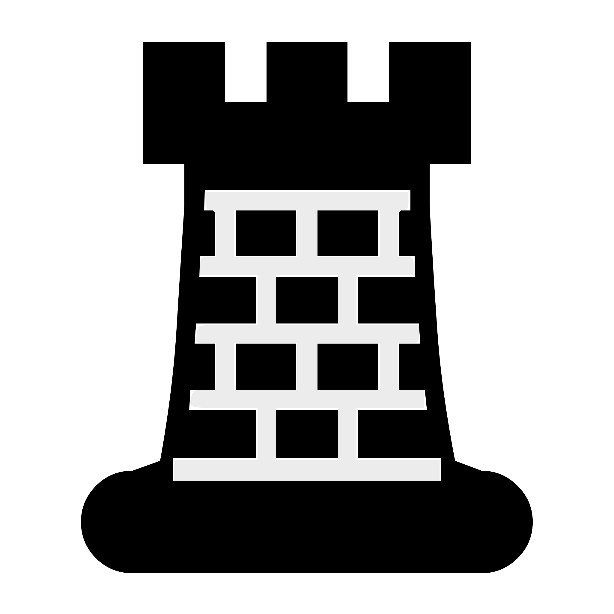
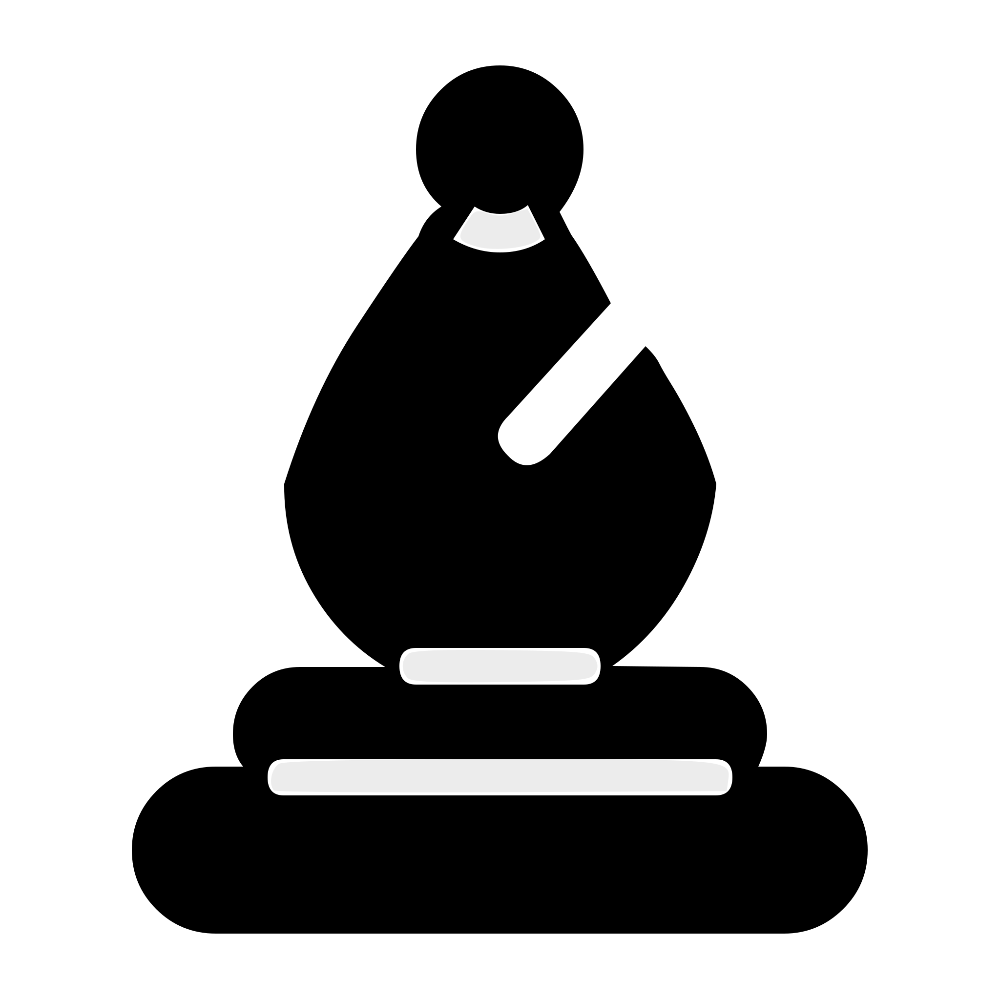
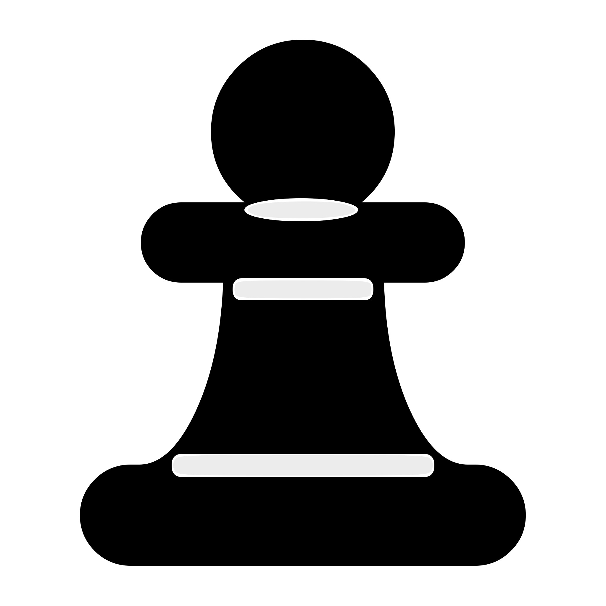

# GitHub Actions Chess Game

This is an open chess game where ANYONE can play - using this README as the game board!  
It's your turn to play! Move a <!-- BEGIN TURN -->black<!-- END TURN --> piece using the table below.

<!-- BEGIN CHESS BOARD -->
|   | A | B | C | D | E | F | G | H |   |
|---|:-:|:-:|:-:|:-:|:-:|:-:|:-:|:-:|:-:|
| **8** |  |  |  |  |  |  |  |  | **8** |
| **7** |  |  |  |  |  |  |  |  | **7** |
| **6** |  |  |  |  |  |  |  |  | **6** |
| **5** |  |  |  |  |  |  |  |  | **5** |
| **4** |  |  |  |  |  |  |  |  | **4** |
| **3** |  |  |  |  |  |  |  |  | **3** |
| **2** |  |  |  |  |  |  |  |  | **2** |
| **1** |  |  |  |  |  |  |  |  | **1** |
|   | **A** | **B** | **C** | **D** | **E** | **F** | **G** | **H** |   |
<!-- END CHESS BOARD -->

**Choose a possbile move here:**
<!-- BEGIN MOVES LIST -->
|  FROM  | TO (Just click a link!) |
| :----: | :---------------------- |
| **A7** | [A5](https://github.com/legojesus/legojesus/issues/new?body=Please+do+not+change+the+title.+Just+click+%22Submit+new+issue%22.+You+don%27t+need+to+add+or+do+anything+else.&title=Chess%3A+Move+A7+to+A5), [A6](https://github.com/legojesus/legojesus/issues/new?body=Please+do+not+change+the+title.+Just+click+%22Submit+new+issue%22.+You+don%27t+need+to+add+or+do+anything+else.&title=Chess%3A+Move+A7+to+A6) |
| **B7** | [B5](https://github.com/legojesus/legojesus/issues/new?body=Please+do+not+change+the+title.+Just+click+%22Submit+new+issue%22.+You+don%27t+need+to+add+or+do+anything+else.&title=Chess%3A+Move+B7+to+B5), [B6](https://github.com/legojesus/legojesus/issues/new?body=Please+do+not+change+the+title.+Just+click+%22Submit+new+issue%22.+You+don%27t+need+to+add+or+do+anything+else.&title=Chess%3A+Move+B7+to+B6) |
| **B8** | [A6](https://github.com/legojesus/legojesus/issues/new?body=Please+do+not+change+the+title.+Just+click+%22Submit+new+issue%22.+You+don%27t+need+to+add+or+do+anything+else.&title=Chess%3A+Move+B8+to+A6), [C6](https://github.com/legojesus/legojesus/issues/new?body=Please+do+not+change+the+title.+Just+click+%22Submit+new+issue%22.+You+don%27t+need+to+add+or+do+anything+else.&title=Chess%3A+Move+B8+to+C6) |
| **C7** | [C5](https://github.com/legojesus/legojesus/issues/new?body=Please+do+not+change+the+title.+Just+click+%22Submit+new+issue%22.+You+don%27t+need+to+add+or+do+anything+else.&title=Chess%3A+Move+C7+to+C5), [C6](https://github.com/legojesus/legojesus/issues/new?body=Please+do+not+change+the+title.+Just+click+%22Submit+new+issue%22.+You+don%27t+need+to+add+or+do+anything+else.&title=Chess%3A+Move+C7+to+C6) |
| **D7** | [D5](https://github.com/legojesus/legojesus/issues/new?body=Please+do+not+change+the+title.+Just+click+%22Submit+new+issue%22.+You+don%27t+need+to+add+or+do+anything+else.&title=Chess%3A+Move+D7+to+D5), [D6](https://github.com/legojesus/legojesus/issues/new?body=Please+do+not+change+the+title.+Just+click+%22Submit+new+issue%22.+You+don%27t+need+to+add+or+do+anything+else.&title=Chess%3A+Move+D7+to+D6) |
| **E7** | [E5](https://github.com/legojesus/legojesus/issues/new?body=Please+do+not+change+the+title.+Just+click+%22Submit+new+issue%22.+You+don%27t+need+to+add+or+do+anything+else.&title=Chess%3A+Move+E7+to+E5), [E6](https://github.com/legojesus/legojesus/issues/new?body=Please+do+not+change+the+title.+Just+click+%22Submit+new+issue%22.+You+don%27t+need+to+add+or+do+anything+else.&title=Chess%3A+Move+E7+to+E6) |
| **F7** | [F5](https://github.com/legojesus/legojesus/issues/new?body=Please+do+not+change+the+title.+Just+click+%22Submit+new+issue%22.+You+don%27t+need+to+add+or+do+anything+else.&title=Chess%3A+Move+F7+to+F5), [F6](https://github.com/legojesus/legojesus/issues/new?body=Please+do+not+change+the+title.+Just+click+%22Submit+new+issue%22.+You+don%27t+need+to+add+or+do+anything+else.&title=Chess%3A+Move+F7+to+F6) |
| **G7** | [G5](https://github.com/legojesus/legojesus/issues/new?body=Please+do+not+change+the+title.+Just+click+%22Submit+new+issue%22.+You+don%27t+need+to+add+or+do+anything+else.&title=Chess%3A+Move+G7+to+G5), [G6](https://github.com/legojesus/legojesus/issues/new?body=Please+do+not+change+the+title.+Just+click+%22Submit+new+issue%22.+You+don%27t+need+to+add+or+do+anything+else.&title=Chess%3A+Move+G7+to+G6) |
| **G8** | [F6](https://github.com/legojesus/legojesus/issues/new?body=Please+do+not+change+the+title.+Just+click+%22Submit+new+issue%22.+You+don%27t+need+to+add+or+do+anything+else.&title=Chess%3A+Move+G8+to+F6), [H6](https://github.com/legojesus/legojesus/issues/new?body=Please+do+not+change+the+title.+Just+click+%22Submit+new+issue%22.+You+don%27t+need+to+add+or+do+anything+else.&title=Chess%3A+Move+G8+to+H6) |
| **H7** | [H5](https://github.com/legojesus/legojesus/issues/new?body=Please+do+not+change+the+title.+Just+click+%22Submit+new+issue%22.+You+don%27t+need+to+add+or+do+anything+else.&title=Chess%3A+Move+H7+to+H5), [H6](https://github.com/legojesus/legojesus/issues/new?body=Please+do+not+change+the+title.+Just+click+%22Submit+new+issue%22.+You+don%27t+need+to+add+or+do+anything+else.&title=Chess%3A+Move+H7+to+H6) |
<!-- END MOVES LIST -->

Having fun? Ask a friend to do the next move!

## How it works

When you click on a possible move's link in the table, it will take you to the creation page of a new issue, where you simply need to submit the issue without adding/altering anything to it. 
A GitHub action is then triggered, which runs a small python script that performs the specified chess movement, updates this README file accordingly and commits the changes.
Refresh this page a few moments after submitting the issue to see your move played out on the board!

  
Last 5 moves in this game

<!-- BEGIN LAST MOVES -->

| Move | Author |
| :--: | :----- |
| `G1` to `F3` | [ @legojesus](https://github.com/legojesus) |
| `Start game` | [ @legojesus](https://github.com/legojesus) |

<!-- END LAST MOVES -->

  
Top 10 most moves across all games

<!-- BEGIN TOP MOVES -->

| Total moves |  User  |
| :---------: | :----- |
| 1 | [@legojesus](https://github.com/legojesus) |

<!-- END TOP MOVES -->

---

Thanks to [@marchizo](https://github.com/marcizhu/) for laying the groundworks for this cool setup!
