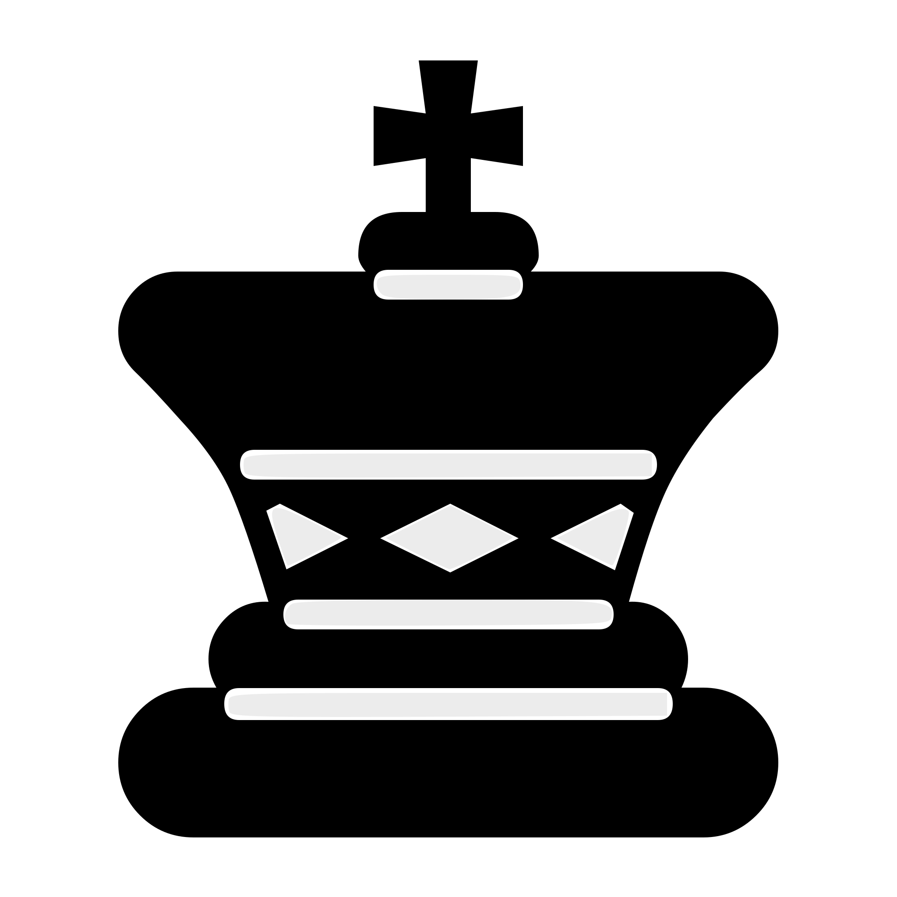

# GitHub Actions Chess Game

This is an open chess game where ANYONE can play - using this README as the game board!  
It's your turn to play! Move a <!-- BEGIN TURN -->white<!-- END TURN --> piece using the table below.

<!-- BEGIN CHESS BOARD -->
|   | A | B | C | D | E | F | G | H |   |
|---|:-:|:-:|:-:|:-:|:-:|:-:|:-:|:-:|:-:|
| **8** |  |  |  |  |  |  |  |  | **8** |
| **7** |  |  |  |  |  |  |  |  | **7** |
| **6** |  |  |  |  |  |  |  |  | **6** |
| **5** |  |  |  |  |  |  |  |  | **5** |
| **4** |  |  |  |  |  |  |  |  | **4** |
| **3** |  |  |  |  |  |  |  |  | **3** |
| **2** |  |  |  |  |  |  |  |  | **2** |
| **1** |  |  |  |  |  |  |  |  | **1** |
|   | **A** | **B** | **C** | **D** | **E** | **F** | **G** | **H** |   |
<!-- END CHESS BOARD -->

**Choose a possbile move here:**
<!-- BEGIN MOVES LIST -->
|  FROM  | TO (Just click a link!) |
| :----: | :---------------------- |
| **A2** | [A3](https://github.com/legojesus/legojesus/issues/new?body=Please+do+not+change+the+title.+Just+click+%22Submit+new+issue%22.+You+don%27t+need+to+add+or+do+anything+else.&title=Chess%3A+Move+A2+to+A3), [A4](https://github.com/legojesus/legojesus/issues/new?body=Please+do+not+change+the+title.+Just+click+%22Submit+new+issue%22.+You+don%27t+need+to+add+or+do+anything+else.&title=Chess%3A+Move+A2+to+A4) |
| **B1** | [A3](https://github.com/legojesus/legojesus/issues/new?body=Please+do+not+change+the+title.+Just+click+%22Submit+new+issue%22.+You+don%27t+need+to+add+or+do+anything+else.&title=Chess%3A+Move+B1+to+A3), [C3](https://github.com/legojesus/legojesus/issues/new?body=Please+do+not+change+the+title.+Just+click+%22Submit+new+issue%22.+You+don%27t+need+to+add+or+do+anything+else.&title=Chess%3A+Move+B1+to+C3), [D2](https://github.com/legojesus/legojesus/issues/new?body=Please+do+not+change+the+title.+Just+click+%22Submit+new+issue%22.+You+don%27t+need+to+add+or+do+anything+else.&title=Chess%3A+Move+B1+to+D2) |
| **B2** | [B3](https://github.com/legojesus/legojesus/issues/new?body=Please+do+not+change+the+title.+Just+click+%22Submit+new+issue%22.+You+don%27t+need+to+add+or+do+anything+else.&title=Chess%3A+Move+B2+to+B3), [B4](https://github.com/legojesus/legojesus/issues/new?body=Please+do+not+change+the+title.+Just+click+%22Submit+new+issue%22.+You+don%27t+need+to+add+or+do+anything+else.&title=Chess%3A+Move+B2+to+B4) |
| **C1** | [D2](https://github.com/legojesus/legojesus/issues/new?body=Please+do+not+change+the+title.+Just+click+%22Submit+new+issue%22.+You+don%27t+need+to+add+or+do+anything+else.&title=Chess%3A+Move+C1+to+D2), [E3](https://github.com/legojesus/legojesus/issues/new?body=Please+do+not+change+the+title.+Just+click+%22Submit+new+issue%22.+You+don%27t+need+to+add+or+do+anything+else.&title=Chess%3A+Move+C1+to+E3), [F4](https://github.com/legojesus/legojesus/issues/new?body=Please+do+not+change+the+title.+Just+click+%22Submit+new+issue%22.+You+don%27t+need+to+add+or+do+anything+else.&title=Chess%3A+Move+C1+to+F4), [G5](https://github.com/legojesus/legojesus/issues/new?body=Please+do+not+change+the+title.+Just+click+%22Submit+new+issue%22.+You+don%27t+need+to+add+or+do+anything+else.&title=Chess%3A+Move+C1+to+G5), [H6](https://github.com/legojesus/legojesus/issues/new?body=Please+do+not+change+the+title.+Just+click+%22Submit+new+issue%22.+You+don%27t+need+to+add+or+do+anything+else.&title=Chess%3A+Move+C1+to+H6) |
| **C2** | [C3](https://github.com/legojesus/legojesus/issues/new?body=Please+do+not+change+the+title.+Just+click+%22Submit+new+issue%22.+You+don%27t+need+to+add+or+do+anything+else.&title=Chess%3A+Move+C2+to+C3), [C4](https://github.com/legojesus/legojesus/issues/new?body=Please+do+not+change+the+title.+Just+click+%22Submit+new+issue%22.+You+don%27t+need+to+add+or+do+anything+else.&title=Chess%3A+Move+C2+to+C4) |
| **D1** | [D2](https://github.com/legojesus/legojesus/issues/new?body=Please+do+not+change+the+title.+Just+click+%22Submit+new+issue%22.+You+don%27t+need+to+add+or+do+anything+else.&title=Chess%3A+Move+D1+to+D2) |
| **D3** | [D4](https://github.com/legojesus/legojesus/issues/new?body=Please+do+not+change+the+title.+Just+click+%22Submit+new+issue%22.+You+don%27t+need+to+add+or+do+anything+else.&title=Chess%3A+Move+D3+to+D4) |
| **E1** | [D2](https://github.com/legojesus/legojesus/issues/new?body=Please+do+not+change+the+title.+Just+click+%22Submit+new+issue%22.+You+don%27t+need+to+add+or+do+anything+else.&title=Chess%3A+Move+E1+to+D2) |
| **E2** | [E3](https://github.com/legojesus/legojesus/issues/new?body=Please+do+not+change+the+title.+Just+click+%22Submit+new+issue%22.+You+don%27t+need+to+add+or+do+anything+else.&title=Chess%3A+Move+E2+to+E3), [E4](https://github.com/legojesus/legojesus/issues/new?body=Please+do+not+change+the+title.+Just+click+%22Submit+new+issue%22.+You+don%27t+need+to+add+or+do+anything+else.&title=Chess%3A+Move+E2+to+E4) |
| **F3** | [D2](https://github.com/legojesus/legojesus/issues/new?body=Please+do+not+change+the+title.+Just+click+%22Submit+new+issue%22.+You+don%27t+need+to+add+or+do+anything+else.&title=Chess%3A+Move+F3+to+D2), [D4](https://github.com/legojesus/legojesus/issues/new?body=Please+do+not+change+the+title.+Just+click+%22Submit+new+issue%22.+You+don%27t+need+to+add+or+do+anything+else.&title=Chess%3A+Move+F3+to+D4), [E5](https://github.com/legojesus/legojesus/issues/new?body=Please+do+not+change+the+title.+Just+click+%22Submit+new+issue%22.+You+don%27t+need+to+add+or+do+anything+else.&title=Chess%3A+Move+F3+to+E5), [G1](https://github.com/legojesus/legojesus/issues/new?body=Please+do+not+change+the+title.+Just+click+%22Submit+new+issue%22.+You+don%27t+need+to+add+or+do+anything+else.&title=Chess%3A+Move+F3+to+G1), [G5](https://github.com/legojesus/legojesus/issues/new?body=Please+do+not+change+the+title.+Just+click+%22Submit+new+issue%22.+You+don%27t+need+to+add+or+do+anything+else.&title=Chess%3A+Move+F3+to+G5), [H4](https://github.com/legojesus/legojesus/issues/new?body=Please+do+not+change+the+title.+Just+click+%22Submit+new+issue%22.+You+don%27t+need+to+add+or+do+anything+else.&title=Chess%3A+Move+F3+to+H4) |
| **G2** | [G3](https://github.com/legojesus/legojesus/issues/new?body=Please+do+not+change+the+title.+Just+click+%22Submit+new+issue%22.+You+don%27t+need+to+add+or+do+anything+else.&title=Chess%3A+Move+G2+to+G3), [G4](https://github.com/legojesus/legojesus/issues/new?body=Please+do+not+change+the+title.+Just+click+%22Submit+new+issue%22.+You+don%27t+need+to+add+or+do+anything+else.&title=Chess%3A+Move+G2+to+G4) |
| **H1** | [G1](https://github.com/legojesus/legojesus/issues/new?body=Please+do+not+change+the+title.+Just+click+%22Submit+new+issue%22.+You+don%27t+need+to+add+or+do+anything+else.&title=Chess%3A+Move+H1+to+G1) |
| **H2** | [H3](https://github.com/legojesus/legojesus/issues/new?body=Please+do+not+change+the+title.+Just+click+%22Submit+new+issue%22.+You+don%27t+need+to+add+or+do+anything+else.&title=Chess%3A+Move+H2+to+H3), [H4](https://github.com/legojesus/legojesus/issues/new?body=Please+do+not+change+the+title.+Just+click+%22Submit+new+issue%22.+You+don%27t+need+to+add+or+do+anything+else.&title=Chess%3A+Move+H2+to+H4) |
<!-- END MOVES LIST -->

Having fun? Ask a friend to do the next move!

## How it works

When you click on a possible move's link in the table, it will take you to the creation page of a new issue, where you simply need to submit the issue without adding/altering anything to it. 
A GitHub action is then triggered, which runs a small python script that performs the specified chess movement, updates this README file accordingly and commits the changes.
Refresh this page a few moments after submitting the issue to see your move played out on the board!

  
Last 5 moves in this game

<!-- BEGIN LAST MOVES -->

| Move | Author |
| :--: | :----- |
| `G8` to `F6` | [ @erezbens](https://github.com/erezbens) |
| `D2` to `D3` | [ @legojesus](https://github.com/legojesus) |
| `D7` to `D6` | [ @AndreiBrandes](https://github.com/AndreiBrandes) |
| `G1` to `F3` | [ @legojesus](https://github.com/legojesus) |
| `Start game` | [ @legojesus](https://github.com/legojesus) |

<!-- END LAST MOVES -->

  
Top 10 most moves across all games

<!-- BEGIN TOP MOVES -->

| Total moves |  User  |
| :---------: | :----- |
| 2 | [@legojesus](https://github.com/legojesus) |
| 1 | [@AndreiBrandes](https://github.com/AndreiBrandes) |
| 1 | [@erezbens](https://github.com/erezbens) |

<!-- END TOP MOVES -->

---

Thanks to [@marchizo](https://github.com/marcizhu/) for laying the groundworks for this cool setup!
